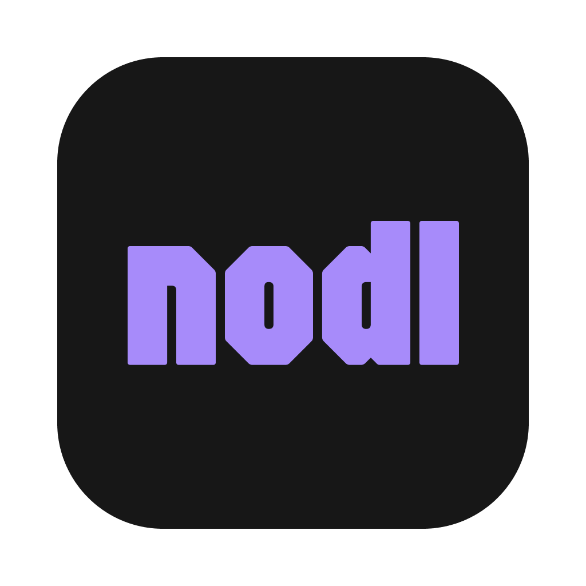

<p align="center">
  
</p>

<h1 align="center">nodl</h1>

<p align="center">
  A fast, lightweight desktop scratchpad for writing and running JavaScript/TypeScript code with instant inline output.
</p>

<p align="center">
  <a href="https://www.nodlapp.site/">Website</a> &nbsp;&middot;&nbsp;
  <a href="https://github.com/hungdoansy/nodl/releases">Download</a> &nbsp;&middot;&nbsp;
  <a href="#features">Features</a> &nbsp;&middot;&nbsp;
  <a href="#installation">Installation</a> &nbsp;&middot;&nbsp;
  <a href="docs/DEVELOPMENT.md">Development</a>
</p>

<p align="center">
  
</p>

---

## Features

- **Monaco Editor** with full TypeScript/JavaScript language support, IntelliSense, and syntax highlighting
- **Inline output** aligned to the source line that produced it, or a sequential console mode
- **Expression evaluation** — standalone expressions show their result inline without needing `console.log`
- **TypeScript out of the box** — write TS directly, types are stripped at execution time via esbuild
- **ESM import support** — `import` statements are auto-converted to `require()` at instrumentation time
- **npm package management** — install, remove, and search npm packages from within the app
- **Async code support** — `setTimeout`, `setInterval`, Promises, and `async/await` all work naturally
- **Multi-tab workspace** — multiple files with auto-persistence across sessions
- **Auto-run mode** — re-executes code on every keystroke with configurable debounce delay
- **Dark and light themes** — warm neutral dark theme by default, with light and system options
- **Scroll-synced panels** — editor and output panels scroll together in aligned mode
- **Keyboard-first** — `Cmd+Enter` to run, `Cmd+N` for new tab, `Cmd+W` to close tab
- **Cross-platform** — macOS, Windows, and Linux

## Installation

Grab the latest release for your platform from [GitHub Releases](https://github.com/hungdoansy/nodl/releases).

| Platform | Files |
|----------|-------|
| macOS (Apple Silicon) | `.dmg`, `.zip` |
| macOS (Intel) | `.dmg`, `.zip` |
| Windows | `.exe` (installer), `.exe` (portable) |
| Linux | `.AppImage`, `.deb` |

### macOS

> [!WARNING]
> nodl is **not code-signed or notarized** by Apple. macOS will block the app on first launch with a message like *"nodl is damaged and can't be opened"* or *"nodl can't be opened because Apple cannot check it for malicious software"*. You must remove the quarantine attribute manually — this is expected and only required once.

1. Download the `.dmg` for your architecture:
   - Apple Silicon (M1/M2/M3/M4) → `nodl-<version>-arm64.dmg`
   - Intel → `nodl-<version>-x64.dmg`
2. Open the DMG and drag **nodl** into your **Applications** folder.
3. Remove the Gatekeeper quarantine flag:
   ```bash
   xattr -cr /Applications/nodl.app
   ```
4. Launch nodl from Applications (or Spotlight).

### Windows

1. Download `nodl-<version>-setup.exe` (installer) or the portable `.exe`.
2. Run the installer, or double-click the portable build to launch directly.
3. SmartScreen may show *"Windows protected your PC"* — click **More info** → **Run anyway**.

### Linux

1. Download the `.AppImage` or `.deb` asset.
2. **AppImage:**
   ```bash
   chmod +x nodl-*.AppImage
   ./nodl-*.AppImage
   ```
3. **Debian / Ubuntu:**
   ```bash
   sudo dpkg -i nodl-*.deb
   ```

### Why the security warnings?

nodl is free and open-source. Apple code-signing certificates cost \$99/year and Windows EV certs are \$300+/year, so releases are distributed unsigned. The quarantine/SmartScreen bypass is a one-time step — after the first launch, the OS remembers your choice.

## Usage

1. **Write code** in the editor (left panel)
2. **Run** with `Cmd+Enter` (macOS) or `Ctrl+Enter` (Windows/Linux)
3. **See output** in the right panel, aligned to the lines that produced it

### Output modes

- **Line-aligned** (default) — output appears next to the source line that generated it
- **Console** — output appears sequentially, like a terminal

Toggle between modes with the button in the output panel toolbar.

### Expression evaluation

Standalone expressions are automatically evaluated and shown inline:

```ts
1 + 2              // => 3
"hello".toUpperCase()  // => "HELLO"
[1, 2, 3].map(x => x * 2)  // => [2, 4, 6]
```

No `console.log` needed for quick checks.

### npm packages

Click **Packages** in the sidebar to install npm packages. Installed packages can be imported with standard `import` syntax:

```ts
import axios from "axios"
import { z } from "zod"
```

Imports are automatically converted to `require()` calls at execution time.

## Development

See [docs/DEVELOPMENT.md](docs/DEVELOPMENT.md) for setup, architecture, project structure, testing, and the tech stack.

## Updates

nodl checks GitHub Releases on launch. When a new version is available, a badge appears in the header. Click it for download instructions. Updates are manual — download the new version and replace the old one.

## Star History

<a href="https://star-history.com/#hungdoansy/nodl&Date">
  <picture>
    <source media="(prefers-color-scheme: dark)" srcset="https://api.star-history.com/svg?repos=hungdoansy/nodl&type=Date&theme=dark">
    <source media="(prefers-color-scheme: light)" srcset="https://api.star-history.com/svg?repos=hungdoansy/nodl&type=Date">
    
  </picture>
</a>

## License

[MIT](LICENSE) &copy; [Hung Doan](https://github.com/hungdoansy)
