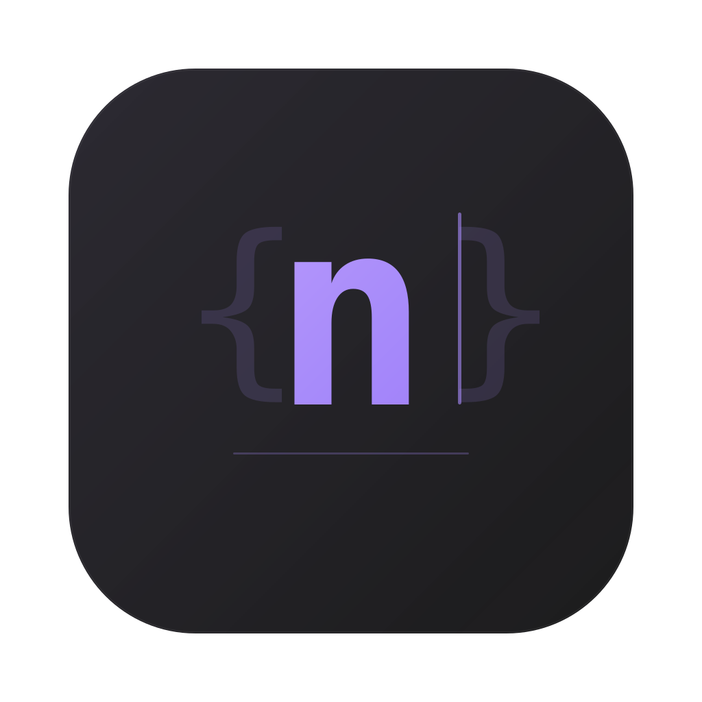

<p align="center">
  
</p>

<h1 align="center">nodl</h1>

<p align="center">
  A fast, lightweight desktop scratchpad for writing and running JavaScript/TypeScript code with instant inline output.
</p>

<p align="center">
  <a href="https://github.com/hungdoansy/nodl/releases">Download</a> &nbsp;&middot;&nbsp;
  <a href="#features">Features</a> &nbsp;&middot;&nbsp;
  <a href="#installation">Installation</a> &nbsp;&middot;&nbsp;
  <a href="#development">Development</a>
</p>

---

## Features

- **Monaco Editor** with full TypeScript/JavaScript language support, IntelliSense, and syntax highlighting
- **Inline output** aligned to the source line that produced it, or a sequential console mode
- **Expression evaluation** — standalone expressions show their result inline without needing `console.log`
- **TypeScript out of the box** — write TS directly, types are stripped at execution time via esbuild
- **ESM import support** — `import` statements are auto-converted to `require()` at instrumentation time
- **npm package management** — install, remove, and search npm packages from within the app
- **Async code support** — `setTimeout`, `setInterval`, Promises, and `async/await` all work naturally
- **Multi-tab workspace** — multiple files with auto-persistence across sessions
- **Auto-run mode** — re-executes code on every keystroke with configurable debounce delay
- **Dark and light themes** — warm neutral dark theme by default, with light and system options
- **Scroll-synced panels** — editor and output panels scroll together in aligned mode
- **Keyboard-first** — `Cmd+Enter` to run, `Cmd+N` for new tab, `Cmd+W` to close tab
- **Cross-platform** — macOS, Windows, and Linux

## Installation

### Download

Grab the latest release for your platform from [GitHub Releases](https://github.com/hungdoansy/nodl/releases).

| Platform | Files |
|----------|-------|
| macOS (Apple Silicon) | `.dmg`, `.zip` |
| macOS (Intel) | `.dmg`, `.zip` |
| Windows | `.exe` (installer), `.exe` (portable) |
| Linux | `.AppImage`, `.deb` |

### macOS

1. Download the `.dmg` file for your architecture
2. Open the DMG and drag **nodl** to your Applications folder
3. On first launch, macOS may block the app because it's unsigned. Run:
   ```bash
   xattr -cr /Applications/nodl.app
   ```
4. Open nodl from Applications

### Windows

1. Download the `.exe` installer or portable version
2. Run the installer (or just open the portable `.exe`)
3. If Windows SmartScreen warns you, click **More info** then **Run anyway**

### Linux

1. Download the `.AppImage` or `.deb` file
2. For AppImage: `chmod +x nodl-*.AppImage && ./nodl-*.AppImage`
3. For Debian/Ubuntu: `sudo dpkg -i nodl-*.deb`

### Why the security warning?

nodl is free and open-source. Code signing certificates cost $99+/year, so the app is distributed unsigned. The `xattr -cr` step (macOS) or SmartScreen bypass (Windows) is only needed once.

## Usage

1. **Write code** in the editor (left panel)
2. **Run** with `Cmd+Enter` (macOS) or `Ctrl+Enter` (Windows/Linux)
3. **See output** in the right panel, aligned to the lines that produced it

### Output modes

- **Line-aligned** (default) — output appears next to the source line that generated it
- **Console** — output appears sequentially, like a terminal

Toggle between modes with the button in the output panel toolbar.

### Expression evaluation

Standalone expressions are automatically evaluated and shown inline:

```ts
1 + 2              // => 3
"hello".toUpperCase()  // => "HELLO"
[1, 2, 3].map(x => x * 2)  // => [2, 4, 6]
```

No `console.log` needed for quick checks.

### npm packages

Click **Packages** in the sidebar to install npm packages. Installed packages can be imported with standard `import` syntax:

```ts
import axios from "axios"
import { z } from "zod"
```

Imports are automatically converted to `require()` calls at execution time.

### Settings

Click **Settings** in the sidebar to configure:

- **Font size** (10–24px)
- **Tab size** (2 or 4 spaces)
- **Word wrap** on/off
- **Minimap** on/off
- **Auto-run** with configurable delay (100–2000ms)
- **Execution timeout** (1–30s)
- **Theme** (dark, light, system)

## Development

### Prerequisites

- [Node.js](https://nodejs.org/) >= 22
- [pnpm](https://pnpm.io/) (v9+)

### Setup

```bash
git clone https://github.com/hungdoansy/nodl.git
cd nodl
pnpm install
pnpm run dev
```

### Scripts

| Command | Description |
|---------|-------------|
| `pnpm run dev` | Start dev mode (hot reload) |
| `pnpm run build` | Production build |
| `pnpm run pack` | Build + package to `.app` / `.exe` (unpacked, for local testing) |
| `pnpm run dist` | Build + package to DMG/installer/AppImage (for distribution) |
| `pnpm run test` | Run unit tests (vitest) |
| `pnpm run test:e2e` | Run E2E tests against packaged app (Playwright) |
| `pnpm run lint` | Type check with TypeScript |

### Architecture

```
User code → instrumentCode() → transpile() → worker (child_process.fork)
                ↓                    ↓              ↓
         Add line tracking      Strip TS types    Execute in sandboxed
         + expr wrapping        via esbuild       AsyncFunction
                                                       ↓
                                              IPC messages → renderer
```

- **Main process** — window management, IPC, code pipeline (instrument → transpile → fork worker)
- **Worker** — forked child process that executes user code in isolation
- **Renderer** — React 19 + Monaco Editor + Zustand state management
- **Preload** — bridges IPC to renderer via `contextBridge`

### Project structure

```
src/
├── main/                    # Electron main process
│   ├── index.ts             # Window, IPC, menu
│   └── executor/
│       ├── instrument.ts    # Code instrumentation
│       ├── transpiler.ts    # esbuild TS → JS
│       ├── runner.ts        # Worker lifecycle
│       ├── worker.ts        # Code execution sandbox
│       └── package-manager.ts
├── preload/index.ts         # contextBridge
├── renderer/main.tsx        # React entry
├── components/              # UI components
├── store/                   # Zustand stores
├── hooks/                   # React hooks
└── ipc/bridge.ts            # Typed IPC wrapper
shared/types.ts              # Shared types + IPC channels
```

### Testing

- **Unit tests** — 243 tests across 11 files (vitest)
- **E2E tests** — 100 tests against the packaged app (Playwright + Electron)
- **Pipeline tests** — full `instrumentCode() → transpile()` chain to catch syntax-breaking instrumentation bugs

### Building for distribution

```bash
# macOS (both architectures)
pnpm run dist

# Output:
# dist/nodl-1.0.0-mac-arm64.dmg
# dist/nodl-1.0.0-mac-x64.dmg
# dist/nodl-1.0.0-mac-arm64.zip
# dist/nodl-1.0.0-mac-x64.zip
```

For local testing without creating installers:

```bash
pnpm run pack
cp -r dist/mac-arm64/nodl.app /Applications/
xattr -cr /Applications/nodl.app
open /Applications/nodl.app
```

## Tech stack

| Layer | Technology |
|-------|-----------|
| Framework | Electron 41 |
| Build | electron-vite + Vite 7 |
| Frontend | React 19 |
| Editor | Monaco Editor |
| State | Zustand 5 |
| Styling | Tailwind CSS 3 |
| Transpiler | esbuild |
| Icons | Lucide React |
| Packaging | electron-builder |
| Testing | Vitest + Playwright |

## Updates

nodl checks GitHub Releases on launch. When a new version is available, a badge appears in the header. Click it for download instructions. Updates are manual — download the new version and replace the old one.

## License

[MIT](LICENSE) &copy; [Hung Doan](https://github.com/hungdoansy)
